# ZL Lightsaber — Assembly Guide
**Double-Blade Configuration** | V2.2

---

## Parts List

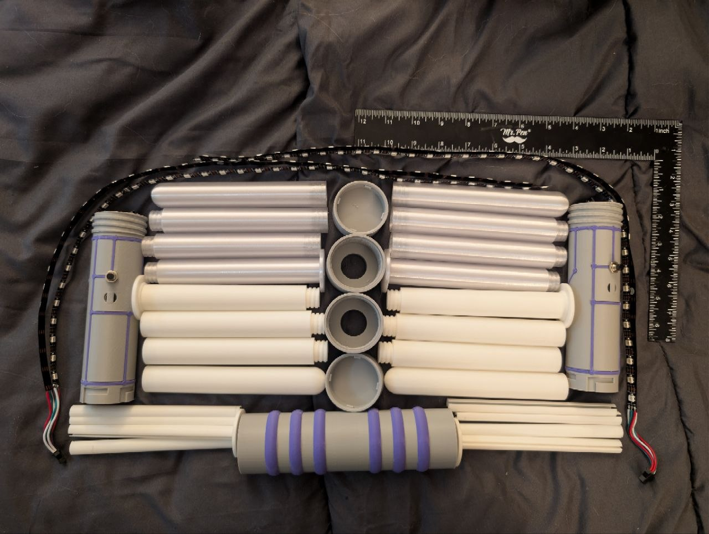

**Per blade (×2):**
- 1× Blade base segment (Tough+ white OR PETG clear)
- 2× Blade mid segments 
- 1× Blade tip segment
- 1× LED base insert (PLA white, has flange/disc at one end)
- 3× LED channel inserts (PLA white, grooved rod sections)
- 1× paired LED strip — 36 LEDs, 60/m WS2812B, pre-soldered JST connector

**Handle assembly (×2):**
- 1× Handle body (Tough+ grey, purple trace inserts installed)
- 1× Open cap (Tough+ grey) — threaded end
- 1× Closed cap (Tough+ grey) — alternate single-blade config only

**Coupler (×1):**
- 1× Coupler body (Tough+ grey, purple ring inserts installed)

> **Note:** The ruler in the parts photo is for scale — blade segments are ~150mm each, full assembled blade is ~600mm tip to base flange.

---

## Phase 1 — LED Insert Assembly

### Step 1 — Start with the LED base insert

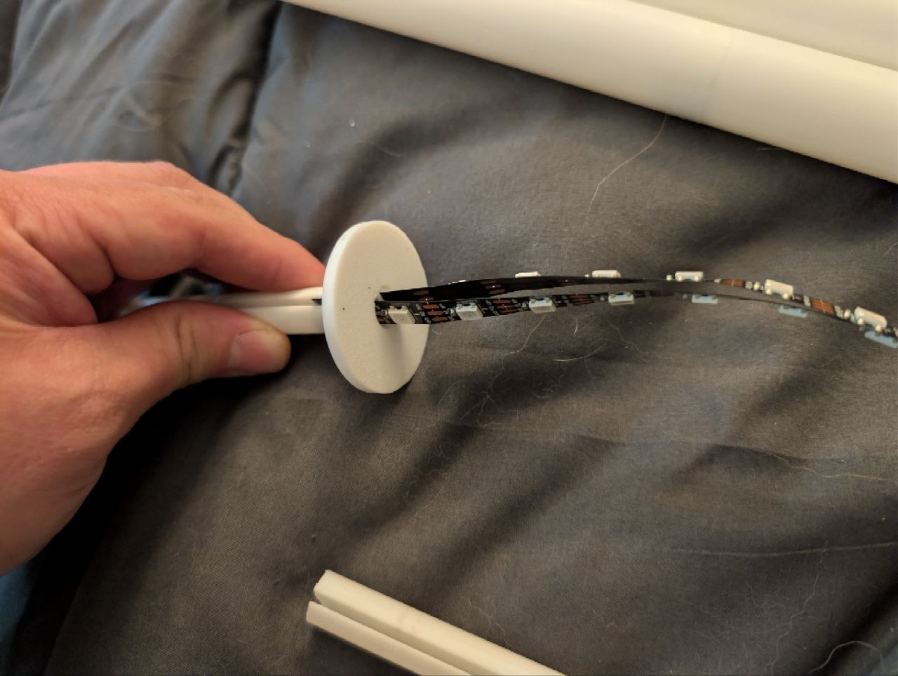

The LED base insert has a flat disc/flange at one end. Thread the LED strip through the slot in the disc so the strip runs along the flat side of the insert rod. The JST connector should be on the disc/flange end — this will be the handle-side.

### Step 2 — Seat strip in channel groove

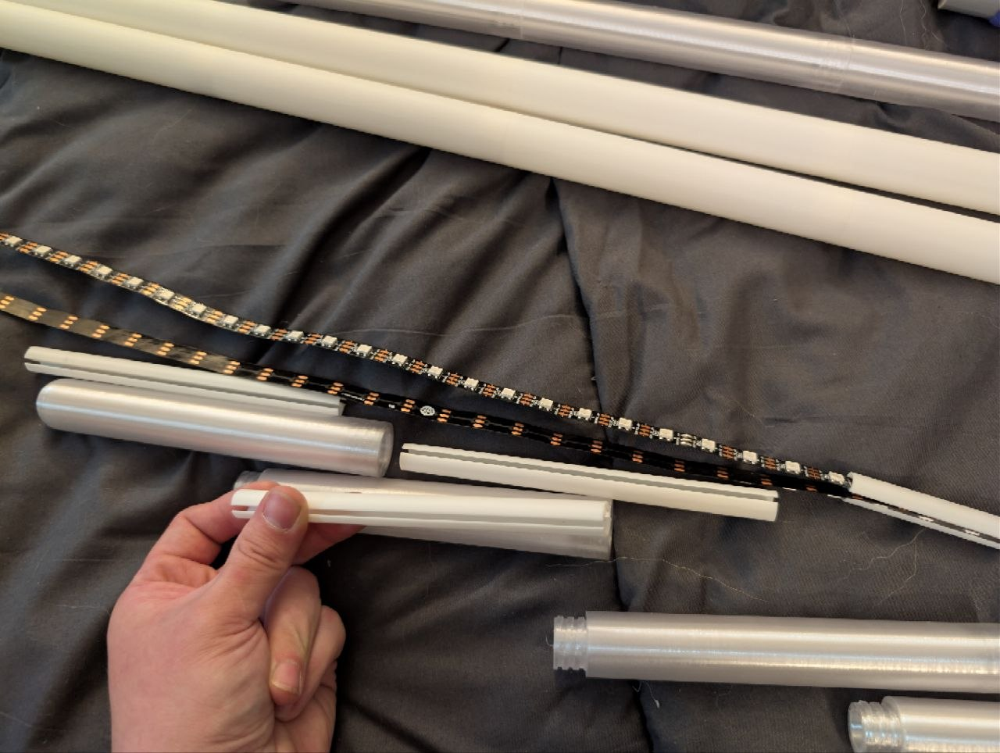

Each channel insert has a groove running its length. Lay the LED strip into this groove, LEDs facing outward. The strip should sit flush — it holds in place via the groove geometry, no adhesive needed for assembly.

### Step 3 — Stack all channel inserts

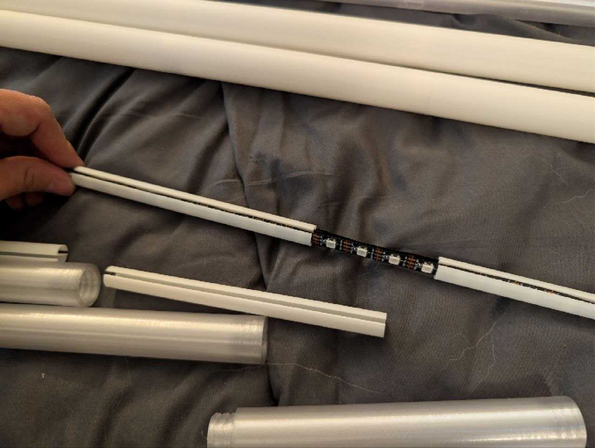

Continue adding the remaining 3 channel inserts end-to-end along the strip length. The inserts butt up against each other. Keep the LED faces all oriented the same direction (outward, toward the blade wall).

### Step 4 — Full LED rod assembly

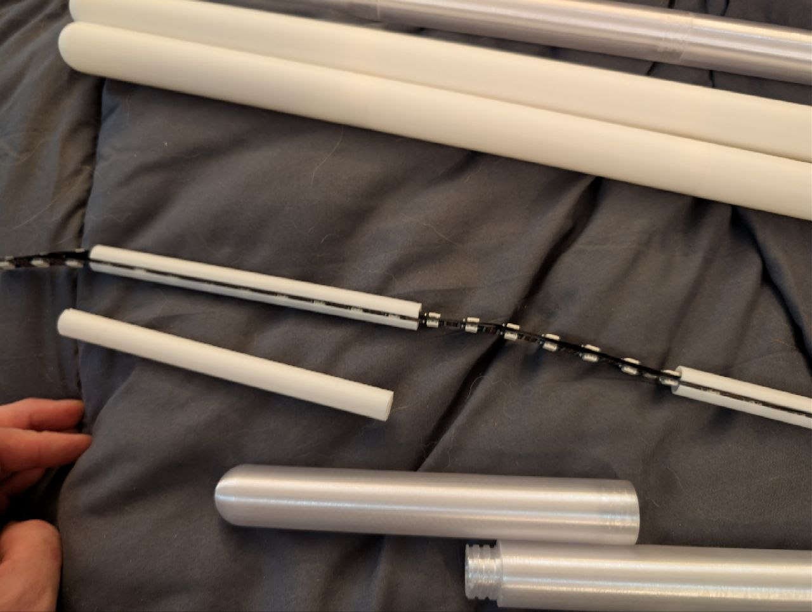

You should now have a complete LED rod: base insert (with JST flange) → 3 channel inserts → LED strips running the full length. Lay it alongside the blade shell segments to confirm it spans the full blade length. The JST connector hangs off the flange end.

---

## Phase 2 — Blade Shell Assembly

### Step 5 — Thread blade segments together

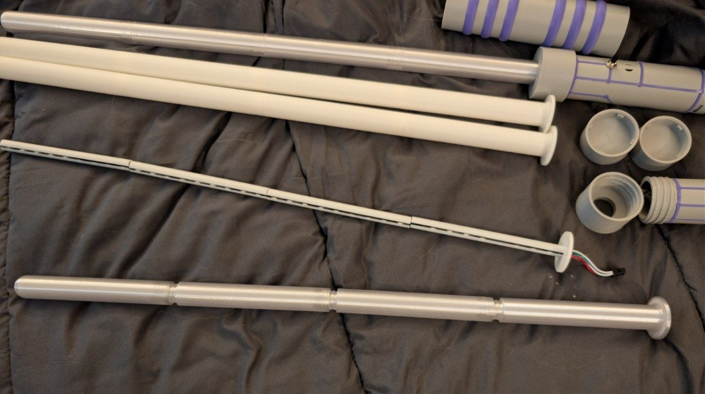

Screw the blade shell segments together in order:
1. Blade base (has the flange without threads)
2. Blade mid × 2
3. Blade tip

Hand-tight is sufficient — these are threaded to snug up firmly without tools.

### Step 6 — Insert LED rod into blade shell

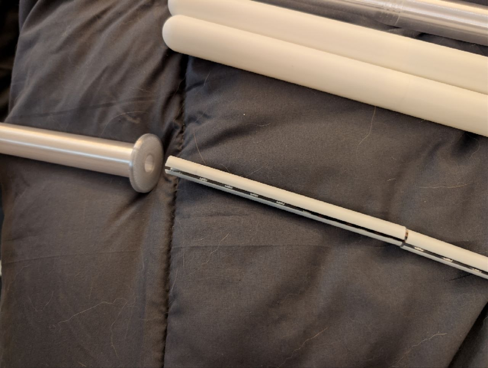

Slide the LED rod assembly into the assembled blade shell from the base end. Feed it tip-first. The base insert flange will seat against the open end of the base segment. The JST connector trails out the bottom.

> The LED rod should fit snugly inside the 12mm ID bore. If it catches, check that the channel inserts are all aligned in the groove.

---

## Phase 3 — Handle Connection

### Step 7 — JST connector closeup

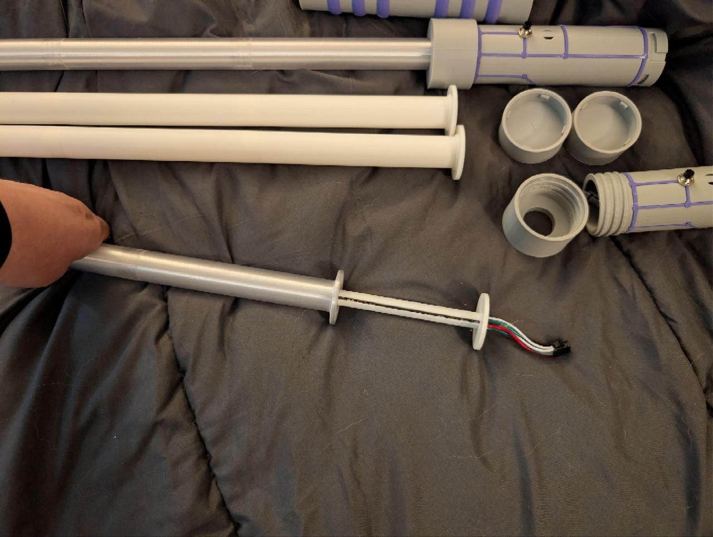

With the blade assembled, the JST connector (3-wire: red, white, green) extends from the base flange. This connects to the matching JST socket inside the handle.

### Step 8 — Connect blade to handle

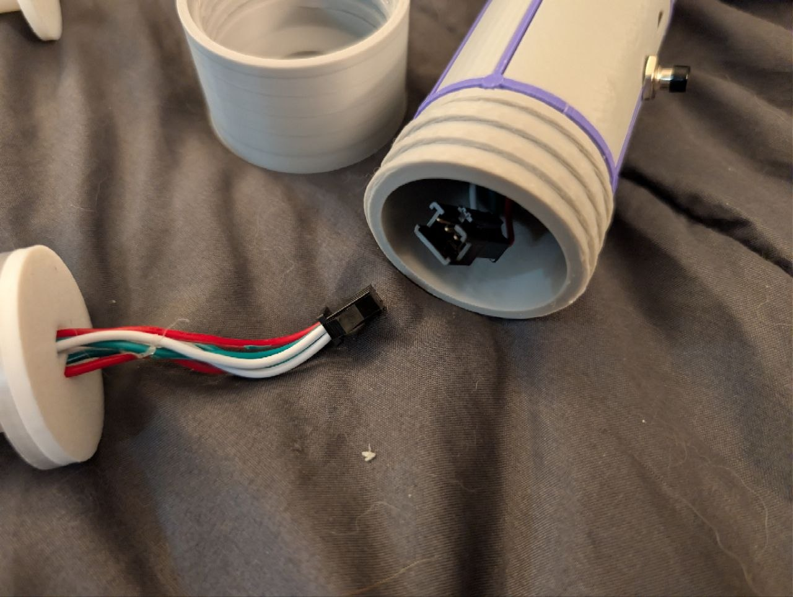

Hold the handle with the threaded blade-end opening facing up. Connect the JST connector into the handle JST socket inside. The connector is keyed — it only goes in one way. Once connected, thread the blade base segment onto the handle using the open cap. Hand-tight.  
I found holding the blade with knees, holding handle still/steady in one hand and screwing the cap on is easiest. Keeping the blade and handle mostly stable while screwing will precent the LEDs from twisting inside for the best visual apprearance.  

> **Polarity note:** The JST connector is keyed but double-check that it seats fully before threading the blade on.

### Step 9 — Power on test

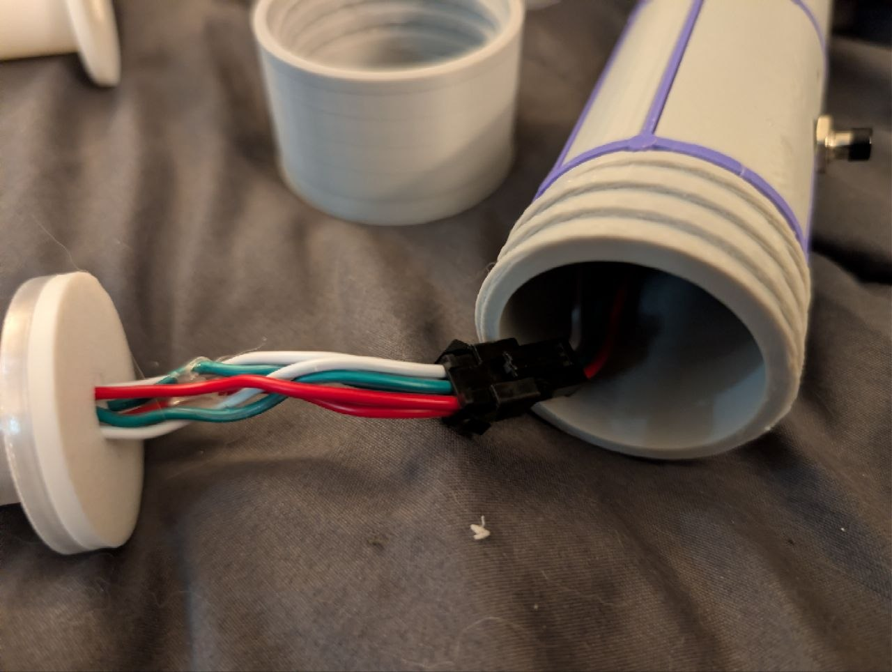
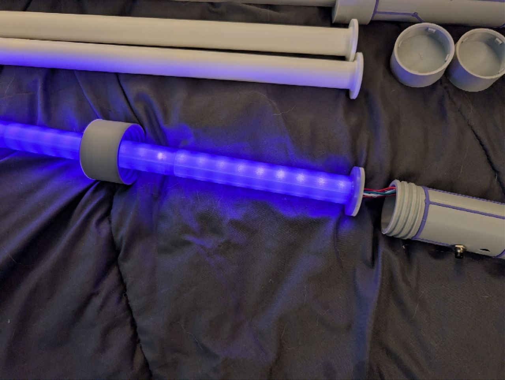

Before finishing assembly, power on and verify the blade lights. The controller is seated inside the handle bore (power switch at the bottom hole). You should see all LEDs respond in a power up sequence before entering the solid color fade mode. 

### Step 10 — Cap the handle

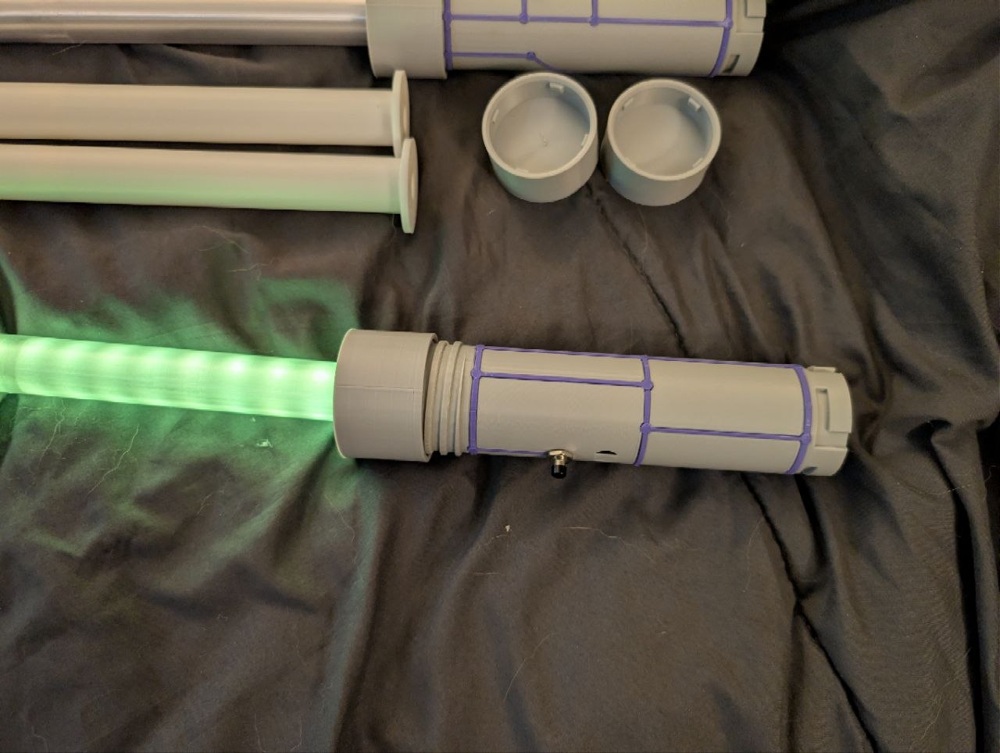

Attach the closed cap onto the pommel end of the handle (bayonet fit — insert and twist).

---

## Phase 4 — Double Blade Config

Repeat Phase 1–3 for the second blade.

> **Double blade config:** Both blades buttons will line up if slotted slightly offset of eachother for the bayonet twist action. 

> **Single blade config:** Use a closed cap on the non-blade end of whichever handle you're using. Drop the coupler entirely.

---

## Notes

- **Blade orientation:** The LED strip groove faces toward the blade wall — LEDs point radially outward for best diffusion through the Tough+ shell.
- **Torque:** Hand-tight only on all threads. The Tough+ material has good thread strength but doesn't need tool torque.
- **Disassembly:** Reverse this guide. The blade unthreads from the handle, JST unplugs, LED rod slides out. No permanent connections.
- **Firmware:** Controller found in this repo as the hardware ZL_C-TH_v1 (can use whatever arduino compatibile you want) - code in Saber directory as .ino and .uf2 (64/255 brightness)

---

*ZL Saber V2.2 — Open Source
